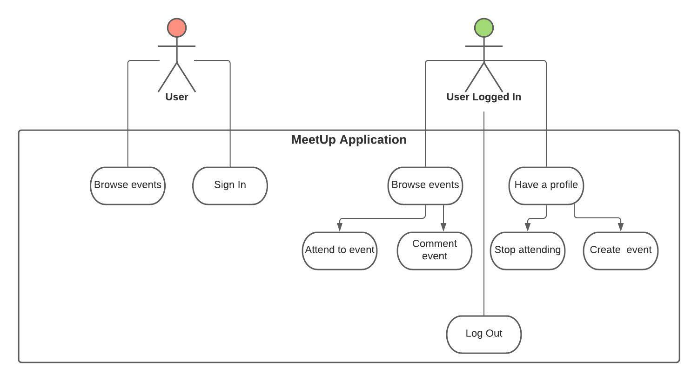

# Meetup-tdd 💃🕺 / App in progress

## Installation

1. Clone this repo ` git clone `
2. Go to the repositori folder
3. Go to api folder `cd api`
4. Install dependencies `npm install`
5. Setup database and seed script `ts-node src/connection/setup.ts && ts-node src/connection/seed.ts`
6. Start server `npm run dev`
7. Go to principal folder `cd ..`
8. Go to meetup folder `cd meetup`
9. Install dependencies `npm install`
10. Start App `npm start`
11. Start tester `npm run test`

## Users to login

- email: david@email.com , password: admin123
- email: romi@email.com , password: user123
- email: nilu@email.com , password: user456
- email: philip@email.com , password: user789

## Use Case Diagram
[UML Diagram](https://lucid.app/lucidchart/2462731b-144b-48e7-95d9-53040c92af52/edit?invitationId=inv_c316cc78-7a3a-48cb-8ebd-68cb20c6d969)

## User Stories

- As user can browse events
- As user can sign in
- As user logged in can browse events
- As user logged in can attend events
- As user logged in can commet events
- As user logged in can create events
- As user logged in can stop attend to events
- As user logged in can log out
